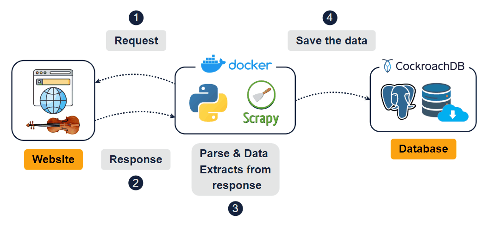

# Violins Scrapy

This project uses **Scrapy** to automate the process of scraping data from a violin e-commerce website. The goal is to gather information about violin products, including their prices, ratings, stock, and more, to analyze trends and fluctuations over time.



## 📝 Project Overview

As a violinist, I decided to explore websites around the world to check violin prices. I thought it would be great to automate this process. After searching for a suitable website, I found one where I could efficiently use the **Scrapy** library to perform web scraping. The key steps of this project are:

### 1️⃣ **Request**

- Scrapy initiates an **HTTP** request to a violin website.
- The request is made to the base URL and subsequent pages of different violin categories.
- The process runs automatically every day at the same time.

### 2️⃣ **Response**

- The website returns the response to the request, which contains the HTML code of the page.
- If the response is not valid (status code ≠ 200), the code will not proceed. (A solution for error handling is being studied).

### 3️⃣ **Parse & Data Extraction from Response**

- Scrapy parses the HTML structure of the page and extracts key data such as:
  - Violin name
  - Price
  - Average rating
  - Number of reviews
  - Stock availability
  - Description
  - Violin image
  - Product category
  - Date the data was captured via web scraping (without needing **.json** or **.csv** files).
- If multiple pages exist, Scrapy follows pagination links and repeats the process.
- The data is processed, converted into appropriate types (strings, numbers, dates), and stored in a structured data frame.

### 4️⃣ **Save the Data**

- The extracted data is inserted into **PostgreSQL** hosted on **CockroachDB**.
- Data is duplicated (because the request is made every day), enabling the comparison of prices and stock fluctuations.

## 🚀 Getting Started

To get started with this project, follow the steps below:

### Prerequisites

Make sure you have the following installed:

- **Python 3.x**

### Installation

1. Clone the repository:

   ```bash
   git clone https://github.com/vinicius-silva-ep/violins-scrapy.git

2. Install required dependencies:

   ```bash
   pip install -r requirements.txt

## 📊 Data Storage 

The extracted data is stored in **PostgreSQL**, which is hosted on **CockroachDB**.

The database only allows write operations; updates are not performed. The average is **300 records daily**.

## 🔧 Future Enhancements

- Implement error handling and logging
- Create a dashboard for data analysis and visualization.